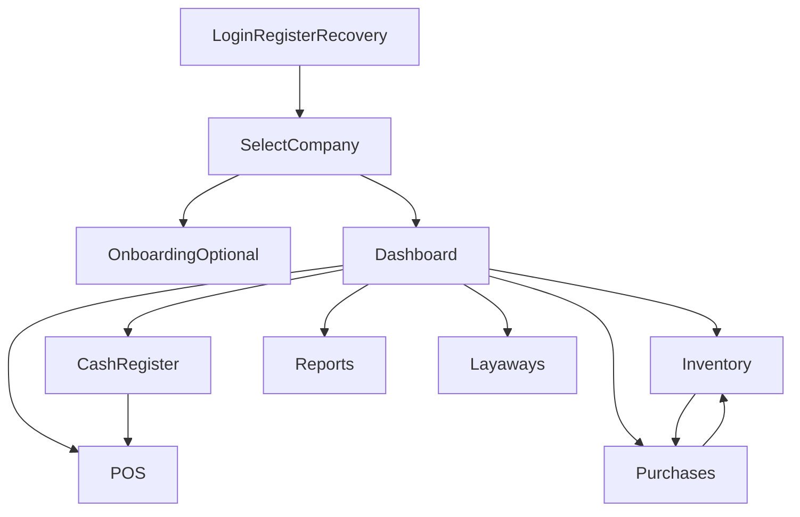

# Analisis profundo por pantallas y flujos E2E

Fecha: 2026-05-04  
Proyecto: `ventuki`

## 1) Inventario de pantallas (ruta -> archivo)

### Publicas / autenticacion
- `/auth/login` -> `/home/kali/Downloads/ventuki/src/features/auth/pages/LoginPage.tsx`
- `/auth/register` -> `/home/kali/Downloads/ventuki/src/features/auth/pages/RegisterPage.tsx`
- `/auth/forgot-password` -> `/home/kali/Downloads/ventuki/src/features/auth/pages/ForgotPasswordPage.tsx`
- `/reset-password` -> `/home/kali/Downloads/ventuki/src/features/auth/pages/ResetPasswordPage.tsx`
- `/auth/select-company` -> `/home/kali/Downloads/ventuki/src/features/auth/pages/SelectCompanyPage.tsx`
- `/onboarding` -> `/home/kali/Downloads/ventuki/src/features/auth/pages/OnboardingPage.tsx`

### Protegidas / operacion
- `/` (dashboard) -> `/home/kali/Downloads/ventuki/src/pages/Index.tsx`
- `/settings` -> `/home/kali/Downloads/ventuki/src/features/settings/pages/CatalogsSettingsPage.tsx`
- `/products` -> `/home/kali/Downloads/ventuki/src/features/products/pages/ProductsPage.tsx`
- `/inventory` -> `/home/kali/Downloads/ventuki/src/features/inventory/pages/InventoryPage.tsx`
- `/suppliers` -> `/home/kali/Downloads/ventuki/src/features/suppliers/pages/SuppliersPage.tsx`
- `/customers` -> `/home/kali/Downloads/ventuki/src/features/customers/pages/CustomersPage.tsx`
- `/purchases` -> `/home/kali/Downloads/ventuki/src/features/purchases/pages/PurchasesPage.tsx`
- `/pos` -> `/home/kali/Downloads/ventuki/src/features/pos/pages/POSPage.tsx`
- `/cash-register` -> `/home/kali/Downloads/ventuki/src/features/cash-register/pages/CashRegisterPage.tsx`
- `/reports` -> `/home/kali/Downloads/ventuki/src/features/reports/pages/ReportsPage.tsx`
- `/invoicing` -> `/home/kali/Downloads/ventuki/src/features/invoicing/pages/InvoicingPage.tsx`
- `/layaways` -> `/home/kali/Downloads/ventuki/src/features/layaways/pages/LayawaysPage.tsx`
- `/layaways/:id` -> `/home/kali/Downloads/ventuki/src/features/layaways/pages/LayawayDetailPage.tsx`

## 2) Flujo maestro de navegacion y operacion

## 3) Flujos y procesos por pantalla (entrada -> operacion -> salida)

### Auth y contexto tenant
- Login: captura credenciales -> `supabase.auth.signInWithPassword` -> sesion iniciada.
- Registro: captura datos usuario -> `supabase.auth.signUp` -> confirmacion por correo.
- Select company: obtiene empresas y sucursales -> setea `company` y `branch` -> redirige a dashboard.
- Onboarding: wizard empresa/sucursal/almacen -> `functions.invoke("onboard-company")` -> contexto operativo listo.

### Dashboard
- Consulta KPIs, resumen de ventas y estado de caja.
- Salidas: alertas operativas, accesos rapidos, visibilidad de salud del negocio.

### Productos
- Alta/edicion/baja logica de productos.
- Búsqueda por SKU/nombre/barcode y refresco de catalogo operativo.

### Inventario
- Consulta stock + kardex.
- Ajuste, reserva y transferencia de stock.
- Conteos fisicos y sugerencias de reabasto.

### Compras
- Creacion de orden borrador.
- Recepcion parcial/total con impacto a inventario.
- Transiciones de estado (draft/confirmada/recibida/cancelada segun reglas).

### POS
- Busqueda de productos/clientes y armado de carrito.
- Validaciones de caja activa y pagos.
- Cierre de venta con impacto a stock y caja.

### Caja
- Apertura de sesion de caja.
- Movimientos operativos y arqueo/cierre.
- Consulta de historial reciente.

### Clientes y Proveedores
- CRUD de maestro comercial.
- Integracion con POS, compras y apartados.

### Apartados
- Alta de apartado con cliente, items, anticipo y vencimiento.
- Registro de abonos, renovaciones y cancelaciones.
- Cierre/cumplimiento de apartado y su relacion con inventario.

### Reportes
- Filtros por fecha y exportable CSV.

### Facturacion
- Pantalla presente pero funcionalidad incompleta en UI (backend parcial separado).

## 4) Riesgos detectados por flujo

1. Inconsistencia de contexto tenant entre `SelectCompanyPage` y `ProtectedRoute` cuando no hay sucursal.
2. Posible bloqueo de creacion de apartados por `branch_id` obligatorio sin selector visible en dialogo.
3. Brecha entre modulo de facturacion UI y capacidades backend.
4. Deuda de arquitectura por mezcla de acceso directo a Supabase y capas use-case/repository.
5. Endpoints/funciones criticas no verificables en cloud con credenciales actuales de frontend.

## 5) Mejoras propuestas por frente

- Flujo: unificar reglas de precondiciones (`user/company/branch`) y estados de entrada/salida por pantalla.
- UX: estandarizar validaciones, mensajes y errores accionables por proceso.
- Operacion: hacer idempotentes los casos criticos (cobro, recepcion, cierre de caja).
- Datos: alinear contratos UI/RPC/DB y eliminar drift entre tablas, migraciones y tipados.
- Observabilidad: agregar auditoria funcional por flujo y tableros de errores por modulo.
