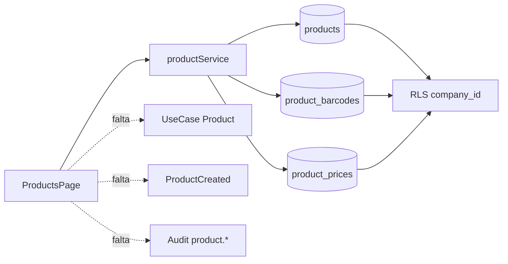
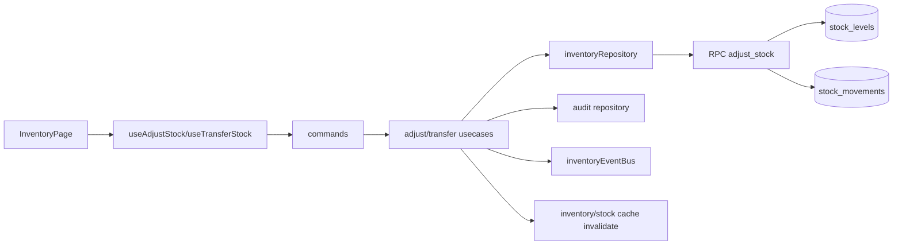
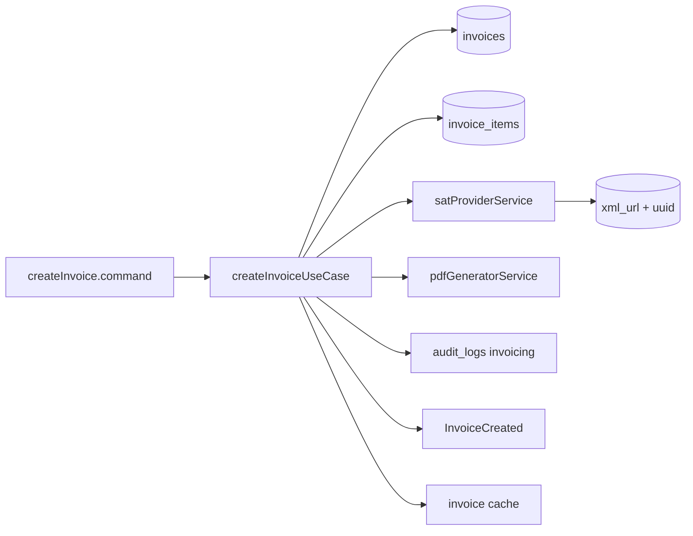

# Auditoría técnica integral — POS SaaS multi-sucursal con CEDIS

**Fecha de auditoría:** 2026-04-06  
**Alcance real auditado:** código frontend (React/TS), capas application/domain/infrastructure por feature, migraciones SQL Supabase, pruebas incluidas en repo.  
**Método:** revisión estática end-to-end de flujos, contratos entre capas y consistencia esquema/código.

---

## 0) Resumen ejecutivo

### Score global de arquitectura (0-100)

| Dimensión | Score | Observación breve |
|---|---:|---|
| Clean Architecture | 58 | Inventario/Facturación tienen capas; Productos/Proveedores/POSPage saltan capas. |
| CQRS | 61 | Hay commands/queries en inventario, POS e invoicing; no es consistente en todo el sistema. |
| Eventos de dominio | 47 | Existen eventos, pero no hay bus transaccional ni outbox; faltan eventos requeridos. |
| Multi-tenant | 64 | Buena base RLS por `company_id`; faltan garantías uniformes de `branch_id`/`warehouse_id` en app. |
| Seguridad/RBAC | 52 | RBAC en código parcial, no centralizado ni validado contra permisos persistidos. |
| Consistencia DB-código | 41 | Hay desacoples críticos entre repositorios y esquema real (ej. `audit_logs`, `sales`). |
| Testing | 38 | Pruebas unitarias/integración en inventario/POS/invoicing, pero cobertura funcional incompleta. |
| Observabilidad (logging/auditoría) | 44 | Logging con `console.*`; auditoría con payloads no alineados al schema base. |

**Score arquitectura ponderado:** **51/100** (riesgo **medio-alto** en operación real multi-sucursal).

### Riesgos críticos (P0)

1. **Desacople schema↔repositorios para auditoría:** repositorios escriben columnas que no existen en `audit_logs` de Fase 1 (`branch_id`, `actor_user_id`, `target_id`, `payload`, `module`), lo que compromete trazabilidad o rompe inserts según entorno.  
2. **Flujos POS/pago no cerrados end-to-end en UI principal:** `POSPage` opera en “modo local” y no invoca `createSaleUseCase`/`processPaymentUseCase`, por lo que no persiste venta/pago/stock en ese flujo visible.  
3. **Reserva/liberación de stock inconsistente:** se registran movimientos `reserve/release` pero no se persiste `reserved_qty`; la regla de disponibilidad queda incompleta.  
4. **Cliente no implementado como flujo de alta:** no hay pantalla/servicio de CRUD de clientes y no se identifica migración de `customers` en las fases funcionales revisadas.

---

## 1) Auditoría flujo creación producto

## 1.1 Pantallas involucradas
- `ProductsPage` (alta/edición/listado/eliminación) con formulario directo y CRUD inmediato.

## 1.2 Hooks utilizados
- No hay hook de caso de uso para create/update; la página llama directamente servicios de infraestructura.

## 1.3 Use cases llamados
- **No hay use case de producto** (patrón Application no aplicado aquí).

## 1.4 Validaciones ejecutadas
- UI valida solo obligatoriedad de `sku` y `name`.
- Sin esquema Zod para producto ni validación central de negocio (barcode único primario por producto, límites de precio/costo, etc.).

## 1.5 Reglas de dominio
- Reglas implícitas: `sku` único por compañía en DB.
- No hay entidad de dominio `Product` ni invariantes en capa domain.

## 1.6 Repositorio DB
- Servicio `productService` usa Supabase directo con filtros por `company_id` en queries principales.
- `deleteProductById(id)` no filtra por `company_id` en app; depende de RLS.

## 1.7 Eventos generados
- **No se emite `ProductCreated`** ni evento equivalente.

## 1.8 Cache actualizado
- No existe capa de cache de productos en este módulo; recarga por `loadProducts()`.

## 1.9 Auditoría generada
- **No hay registro de auditoría de producto** al crear/editar/eliminar.

## 1.10 Testing existente
- No se localizaron tests unitarios/integración/e2e de producto.

## 1.11 Hallazgos
- **Lógica en UI:** validación y orquestación de persistencia en página.  
- **Validaciones duplicables/incompletas:** validación parcial UI + constraints DB, sin capa intermedia.  
- **Acceso DB desde UI:** sí (a través de service directo, sin caso de uso).  
- **Dependencia circular:** no observada en este flujo.

---

## 2) Auditoría flujo inventario (Producto → Inventario → Stock → Kardex)

## 2.1 Flujo observado
- Ajustes y transferencias pasan por hooks (`useAdjustStock`, `useTransferStock`) → commands → use cases → repositorios.
- Kardex lee `stock_movements` vía query/usecase dedicado.

## 2.2 Validaciones solicitadas
- **Creación registro inventario:** se crea/upserta en `adjust_stock` (RPC). ✔️
- **Stock inicial:** en RPC, inserta `GREATEST(_delta,0)` en alta inicial. ⚠️ semántica ambigua para `delta<0` en primer movimiento.
- **Sucursal/almacén correcto:** app filtra por warehouse; branch se deriva por join de warehouse. ⚠️ no siempre se valida consistencia branch↔warehouse en app.
- **Multi-tenant:** filtro `company_id` en queries + RLS. ✔️ parcial.
- **Evento `StockCreated`:** **no existe** evento explícito de alta de stock.
- **Repositorios:** existen (`inventoryRepository`, `movementRepository`, etc.). ✔️

## 2.3 Hallazgos
- **Inconsistencias de stock potenciales:** transferencias ejecutan 2 ajustes secuenciales sin transacción de aplicación/outbox.  
- **Duplicidad inventario:** protegido por `UNIQUE(company_id, warehouse_id, product_id)` (o variante), bajo riesgo en DB.  
- **Cálculos incorrectos:** riesgo medio en reserva/liberación (no persistencia de reservados).

---

## 3) Auditoría flujo stock

## 3.1 Aumentar/disminuir
- `adjustStockUseCase` valida schema + permiso + regla no negativo (dominio + RPC). ✔️

## 3.2 Reserva/liberación
- `reserveStockUseCase` y `releaseStockUseCase` solo insertan movimiento/auditoría/evento.
- **No actualizan `reserved_qty`** en `stock_levels` (ni hay campo persistido en esquema actual revisado).

## 3.3 No stock negativo
- En ajuste sí: validación domain + control SQL en RPC (versiones de migration varían).
- En reserva/liberación, la disponibilidad real de reservados no queda consolidada.

## 3.4 Concurrencia
- Ajustes vía RPC con `ON CONFLICT ... DO UPDATE` ayudan a concurrencia básica.
- **Riesgo:** transferencias y pagos con múltiples líneas no usan transacción de negocio envolvente.

## 3.5 Hallazgos
- **Regla de stock negativo:** razonable en ajuste; incompleta en reserva.  
- **Eventos:** emitidos (`inventory.stock.adjusted/reserved/released/transferred`) pero sin persistencia duradera tipo outbox.

---

## 4) Auditoría flujo clientes

- **Alta cliente:** no hay pantalla de alta cliente en rutas activas.
- **Validación RFC/email:** no hay flujo de alta cliente para validar.
- **Multi-tenant:** existe repo POS para búsqueda por `company_id`.
- **Repositorio:** `customerRepository.getCustomers` existe para consulta, no para alta.
- **Eventos:** no se encontraron eventos de dominio de cliente.

**Conclusión:** flujo de creación cliente solicitado en alcance **no está implementado** end-to-end.

---

## 5) Auditoría flujo proveedores

- Pantalla `SuppliersPage` sí implementa alta/edición/eliminación.
- Validación actual: nombre obligatorio (UI).
- Sin validación formal de email/RFC/tax_id por schema.
- Multi-tenant por `company_id` en consultas principales.
- No se registra evento de dominio de proveedor.
- No hay auditoría explícita en create/update/delete proveedor.
- Relación compras: sí, `purchases.supplier_id` referencia `suppliers.id` en DB.

---

## 6) Auditoría flujo venta (Producto → POS → Venta → Stock → Pago)

## 6.1 Validaciones solicitadas
- Selección producto / cálculo totales / descuento / impuestos: **sí en memoria** (`CartEntity`) en UI POS.
- Stock disponible: validado para agregar al carrito y en ajuste al descontar (cuando usecase se ejecuta).
- Reserva stock: no integrada en flujo POS principal.
- Descontar stock: existe en `processPaymentUseCase` con `adjust_stock` RPC.
- Evento `SaleCreated`: no hay evento explícito con ese nombre (sí `sale.created` de auditoría y `SaleCompleted`).
- Auditoría: `createSaleUseCase` registra `sale.created`; pero `POSPage` principal no usa ese caso.

## 6.2 Hallazgos críticos
- **Lógica en UI:** `POSPage` finaliza venta en modo local (`toast`) sin persistir DB.  
- **Cálculo duplicado:** potencial entre cálculo UI local y flujo de usecase (cuando se use).  
- **Redondeo:** `toFixed` en frontend vs precisión numérica DB puede divergir.  
- **Falta transacción DB end-to-end:** pago, descuento de stock y cierre venta no están envueltos atómicamente en una sola transacción de negocio.

---

## 7) Auditoría flujo pago

- `processPaymentUseCase` soporta arreglo de pagos (efectivo/tarjeta/mixto) y valida monto total.
- Cambio: se modela a nivel `PaymentEntity`/totales, pero UX principal de `POSPage` solo maneja efectivo.
- Estado venta pagada: `saleRepository.updateTotals(..., "completed")` en usecase.
- Riesgo: si falla descuento de stock tras insertar pagos, no hay rollback garantizado multi-step.

---

## 8) Auditoría flujo facturación (Venta → Pago → Factura → SAT)

- Use case `createInvoiceUseCase` sí implementa: folio por serie, persistencia de factura/items, timbrado (simulado/finkok adapter), guardado UUID/XML/PDF, evento `invoice.created`, auditoría.
- Datos fiscales cliente: validados por `invoiceSchema` (a nivel comando).
- Impuestos: `TaxCalculationEntity` existe.
- SAT: servicio desacoplado (`satProviderService`) pero en modo simulado si faltan credenciales.

**Brecha:** no hay evidencia de integración automática obligatoria POS→Invoice en rutas/pantallas activas.

---

## 9) Auditoría multi-tenant

## 9.1 Validación global
- En general se usa `company_id` en queries de features.
- `branch_id` y `warehouse_id` no son uniformemente obligatorios en todos los accesos.

## 9.2 Fugas potenciales
- Operaciones por `id` sin `company_id` en capa app (ej. get/edit/delete específicos) dependen totalmente de RLS.
- RLS es base sólida, pero app debería reforzar filtros tenant para defensa en profundidad.

---

## 10) Auditoría RBAC

- Inventario tiene mapeo por rol y `ensureInventoryPermission`.
- POS e Invoicing validan permisos recibidos por parámetro, sin resolverlos de fuente de verdad en backend.
- `ProductsPage`, `SuppliersPage`, `PurchasesPage` no muestran enforcement RBAC explícito de acción fina en UI.

**Permisos solicitados auditados:**
- crear producto: no verificado por RBAC de aplicación (depende RLS/políticas).  
- crear venta: cubierto por `pos.create` en usecase, pero no por `POSPage` local.  
- ajustar inventario: sí (`inventory.adjust`).  
- cancelar venta: existe comando/usecase, no verificado en pantalla principal.  
- facturar: sí (`invoice.create`) en usecase.

---

## 11) Auditoría CQRS

- **Sí aplicado parcialmente:** inventario, POS e invoicing contienen carpetas `commands` y `queries` separadas.
- **No consistente en todo el proyecto:** producto/proveedor/compras usan services directos a DB.
- Queries con lógica de negocio: `getProductsQuery` mezcla agregación de precio/stock/cache (lógica de aplicación ligera); aceptable pero requiere límite claro.

---

## 12) Auditoría eventos de dominio

Estado de eventos requeridos:
- `ProductCreated`: **faltante**.
- `StockAdjusted`: existe (`inventory.stock.adjusted` y `StockAdjusted` en POS).
- `SaleCompleted`: existe (`SaleCompleted.event.ts`).
- `InvoiceCreated`: existe (`invoice.created`).

Riesgos:
- nomenclatura inconsistente (`name` vs `type`, camel/pascal/dotted).
- bus basado en `window.dispatchEvent` (frontend), no durable ni transaccional.

---

## 13) Auditoría base de datos

## 13.1 Relaciones / FKs / normalización
- Productos, proveedores, compras, inventario y facturas tienen relaciones básicas bien modeladas.
- Índices principales presentes por `company_id` y columnas de acceso frecuente.

## 13.2 Riesgos detectados
- **Múltiples migraciones solapadas** para entidades similares (catálogos/inventario/compras), elevando riesgo de drift por entorno.
- **Desalineación tabla `audit_logs` vs repositorios actuales** (columnas incompatibles).
- Tablas consumidas por POS (`sales`, `sale_payments`, potencial `cash_movements`) no quedaron evidenciadas en migraciones revisadas de manera consistente.

---

## 14) Auditoría hooks

- Inventario: hooks mayormente desacoplados y delegando a commands/usecases.
- POS: existe ecosistema de hooks desacoplados (`usePOS`, `useCart`, etc.), pero la pantalla principal implementada usa lógica directa en componente y no los integra de forma completa.
- No se detectó acceso DB directo dentro de hooks revisados (sí vía repos/service).

---

## 15) Auditoría testing

- **Unitarios:** presentes en inventario/pos/invoicing (`stock.entity`, `rules`, `tax-calculation`).
- **Integración:** presentes (`sale-flow.integration`, `sale-to-invoice`, `invoice-cancel`, `transfer`).
- **E2E:** existen archivos (`pos-smoke`, `pos-cfdi`, `concurrency`), no verificados en ejecución en esta auditoría.
- **Cobertura:** no hay reporte de cobertura integrado visible.

Resultado de ejecución local actual:
- `npm test` falla por dependencia de entorno (`vitest` no encontrado; node_modules no instalado).

---

## 16) Entregables solicitados

## 16.1 Diagrama flujo producto



## 16.2 Diagrama flujo inventario



## 16.3 Diagrama flujo venta

```mermaid
flowchart LR
  PUI[POSPage actual] --> CART[CartEntity en memoria]
  CART --> PAYLOCAL[valida efectivo local]
  PAYLOCAL --> TOAST[toast "modo local"]

  subgraph Flujo objetivo (parcialmente implementado)
    CMD[createSale/processPayment commands] --> UCS[usecases POS]
    UCS --> DBSALE[(sales/sale_payments)]
    UCS --> RPCS[adjust_stock]
    UCS --> EVTS[SaleCompleted + StockAdjusted]
    UCS --> AUDS[audit sale.*]
  end
```

## 16.4 Diagrama flujo facturación



## 16.5 Problemas encontrados (top)

| ID | Problema | Severidad | Módulo |
|---|---|---|---|
| P0-1 | `POSPage` no persiste venta/pago/stock (modo local) | Crítica | POS |
| P0-2 | Repos de auditoría no alineados al schema `audit_logs` base | Crítica | Inventario/POS/Invoicing |
| P0-3 | Reserva/liberación stock no persiste reservado | Crítica | Inventario |
| P1-1 | Flujo creación cliente inexistente | Alta | Customers |
| P1-2 | Falta `ProductCreated` y auditoría de producto/proveedor | Alta | Productos/Proveedores |
| P1-3 | RBAC inconsistente entre módulos | Alta | Cross-module |
| P2-1 | Eventos sin outbox ni durabilidad | Media | Arquitectura |
| P2-2 | Duplicidad/solapamiento de migraciones | Media | DB/DevEx |

## 16.6 Riesgos críticos
- Pérdida de trazabilidad y compliance de auditoría.
- Inconsistencia operativa entre lo que ve caja y lo que persiste DB.
- Incidencias de stock reservado/disponible bajo concurrencia.
- Riesgo de regresiones por drift schema/migraciones.

## 16.7 Refactor recomendado

### Fase A (inmediata, 1-2 sprints)
1. Conectar `POSPage` al flujo CQRS real (`createSale` + `processPayment`).
2. Unificar contrato `audit_logs` (migración + repositorios) con campos canónicos.
3. Implementar modelo de stock reservado persistente (`reserved_qty` + funciones transaccionales).
4. Implementar módulo de clientes (UI + usecase + validaciones RFC/email + auditoría + tests).

### Fase B (siguiente, 2-3 sprints)
1. Migrar productos/proveedores/compras a usecases + schemas + auditoría + eventos.
2. Estandarizar RBAC centralizado (fuente permisos server-side).
3. Homologar naming de eventos y crear event dispatcher durable (outbox).

### Fase C (madurez)
1. Cobertura de pruebas por flujo E2E crítico (producto→inventario→venta→pago→factura).
2. Logging estructurado con correlación (`request_id`, `company_id`, `branch_id`).

## 16.8 Código a corregir (mapa rápido)
- `src/features/pos/pages/POSPage.tsx` (orquestación local no persistente).
- `src/features/inventory/application/reserveStock.usecase.ts` y `releaseStock.usecase.ts` (reservado no persistente).
- `src/features/inventory/infrastructure/audit.repository.ts`
- `src/features/pos/infrastructure/audit.repository.ts`
- `src/features/invoicing/infrastructure/audit.repository.ts`
- `src/features/products/pages/ProductsPage.tsx` + `services/productService.ts` (falta usecase/event/audit).
- `src/features/suppliers/pages/SuppliersPage.tsx` + `services/supplierService.ts` (falta schema/audit/event).

## 16.9 Prioridad corrección

| Prioridad | Objetivo |
|---|---|
| P0 | Cerrar flujo venta/pago persistente + coherencia auditoría + stock reservado |
| P1 | Completar clientes + robustecer productos/proveedores con clean architecture |
| P2 | Endurecer eventos, RBAC central y cobertura e2e |

---

## 17) Resultado esperado vs estado actual

### Inconsistencias
- Arquitectura híbrida: módulos con clean architecture coexistiendo con CRUD directo UI→DB.

### Bugs funcionales potenciales
- Venta “completada” visualmente sin persistencia en flujo principal POS.

### Errores de arquitectura
- Falta de atomicidad transaccional cross-step en pago/stock/estado venta.

### Problemas de seguridad
- Enforcement RBAC parcial/inconsistente a nivel módulo.

### Duplicación de lógica
- Cálculo y validación repartidos entre UI y usecases.

### Errores DB
- Contrato `audit_logs` no homogéneo entre SQL base y repositorios TS.

### Mejoras escalabilidad
- Introducir outbox/event bus durable, logging estructurado y CQRS consistente en todos los módulos críticos.

---

## Apéndice A — Evidencia clave revisada

- Pantallas activas: `ProductsPage`, `InventoryPage`, `SuppliersPage`, `PurchasesPage`, `POSPage`.
- Usecases inventario/POS/invoicing: `adjustStockUseCase`, `transferStockUseCase`, `createSaleUseCase`, `processPaymentUseCase`, `createInvoiceUseCase`.
- Migraciones fases 1/3/4/5 y migración consolidada posterior.
- Pruebas presentes en carpetas `testing` de inventario/POS/invoicing.

